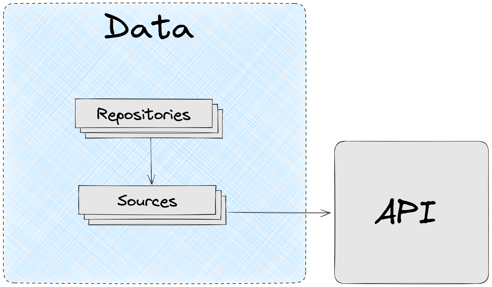

# Data

## Основная концепция



`Data` слой отвечает за работу с данными:

- Получения данных из источников (сервер, localStorage…)
- Агрегация и форматирование данных
- Кэширование и модификация кэша
- Хранение и распространение DTO по приложению

`Data` позволяет:

- Защитить приложение от изменений API
- Отвязаться от источника данных и методе их получения

`Data` содержит два сегмента:

- `Repositories` . Facade, предоставляющий данные приложению.
- `Sources`. Сервисы, отвечающие за получение данных из разных источников. Sources может быть автосгенерированным

```
├── app/                          
├── screens/                  
├── modules/        
├── data/
|    ├── repositories/ 
|    ├── sources/
|    └── index.ts                  
└── shared/    
```

## Защита от изменений API

`Data` позволяют защитить приложение от изменений API.

`Sources` напрямую зависят от API и источника, они недоступны для остального приложения.

Приложение зависит только от `Repositories,` поэтому при нежелательном изменении интерфейса данных на API, изменения коснуться только `Repositories` , остальная часть приложения останется неизменной.


**Пример**

Мы получаем с сервера данные о тарифе. `tariffNetworkSources` отвечает за получение данных из конкретного источника по REST.

`TariffRepository` в свою очередь использует `tariffNetworkSources` для получения данных и их форматирования для приложения.

В какой-то момент API изменило формат данных для тарифов. Если мы не хотим вносить правки в `Modules`, которые потребляют данные, то мы можем на уровне `TariffRepository` сделать правки, по приведению нового интерфейса данных тарифов к тому, что ожидает наше приложение.

В итоге: правки были внесены только в `TariffRepository` , остальная система затронута не была.

## Независимость приложения от источника данных

Благодаря `Data` приложение не зависит от источника данных. По необходимости источник данных и метод получения данных может быть изменен.

`Repositories` используют `Sources` для получения данных.  `Sources` при этом зависит от конкретного метода получения данных (REST, GQL, WS…). Приложение в свою очередь взаимодействует только с `Repositories` и не знает откуда и как данные были получены.

**Пример**

`tariffSourcesNetwork` может получать данные по REST, при этом `requestSourcesNetwork` может получать данные по GQL.

Нам необходимо получить данные о заявке и выбранной в ней тарифе. `RequestRepository` предоставит нашему приложению метод `getRequestWithTariff` , который соберет данные из разных источников и отдаст их приложению.

Итог: приложение не знает каким способом и от куда были запрошены данные.

## Sources

`Sources` - это сервисы, ответственные за получение данных. `Sources` зависят от конкретного источника данных.

`Sources` могут быть сгенерированы по OpenAPI или другим доступным способом.

`Sources` не содержат никакой логики, они просто ходят за данными в нужный источник.

**Пример получения данных по REST**

```tsx
import { apiHttpClient } from '@astral/shared';

import { TariffNetworkSourcesDTO } from './dto';

export const tariffsNetworkSources = {
  getTariffs: () => apiHttpClient.get<void, TariffNetworkSourcesDTO.TariffList>('/tariffs'),
};
```

`Sources` содержат:

- Сервис получения данных
- DTO

Пример структуры:

```
├── app/                          
├── screens/                  
├── modules/        
├── data/
|    ├── repositories/ 
|    ├── sources/
|    |    ├── tariffsNetworkSources/
|    |    |    ├── tariffsNetworkSources.ts
|    |    |    ├── dto.ts
|    |    |    └── index.ts
|    |    └── index.ts            
|    └── index.ts                  
└── shared/    
```

**`Sources` - это приватные сервисы слоя `Data`. `Sources` недоступны в других слоях. Все взаимодействие с данными в приложении происходит через `Repositories`.**

### Разные источники данных

`Sources` могут получать данные из разных источников, разными способами:

- REST
- GraphQL
- LocalStorage
- IndexDB
- Cookie
- Файловая система
- …

### DTO

`Sources` содержат типы данных, которые надо отправить на сервер и типы данных, которые приходят в ответ.

Все типы DTO находятся в файле `dto.ts`.

```
├── app/                          
├── screens/                  
├── modules/        
├── data/
|    ├── repositories/ 
|    ├── sources/
|    |    ├── tariffsNetworkSources/
|    |    |    ├── tariffsNetworkSources.ts
|    |    |    ├── dto.ts
|    |    |    └── index.ts
|    |    └── index.ts            
|    └── index.ts                  
└── shared/    
```

## Repositories

`Repositories` - это фасады, используемые в приложении для работы с данными.

`Repositories:`

- Используют `sources` для получения данных из разных источников
- Форматируют данные для приложения
- Агрегируют данные из разных источников
- Кэшируют данные. Позволяют работать с данными кэша (модифицировать, инвалидировать…)

`Repositories` содержит сервисы для работы с данными.

Пример структуры:

```
├── app/                          
├── screens/                  
├── modules/        
├── data/
|    ├── repositories/ 
|    |    ├── UserRepository/
|    |    |    ├── UserRepository.ts
|    |    |    ├── UserRepository.test.ts
|    |    |    ├── dto.ts
|    |    |    ├── enums.ts
|    |    |    └── index.ts
|    |    ├── enums.ts
|    |    ├── types.ts
|    |    └── index.ts      
|    ├── sources/      
|    └── index.ts                  
└── shared/    
```

[Пример `Repository:`](https://github.com/kaluga-astral/vite-boilerplate/blob/main/data/repositories/BookRepository/BookRepository.ts)

### Разбиение на Repositories

Каждый `Repository` ответственен за работу с конкретным типом данных.

**Пример**

В предметной области онлайн-магазина нам необходимо получать данные о:

- Пользователе
- Товарах
- Акциях

Для каждого типа данных должны быть созданы свои `Repositories`:

```
├── app/                          
├── screens/                  
├── modules/        
├── data/
|    ├── repositories/ 
|    |    ├── UserRepository/
|    |    ├── GoodsRepository/
|    |    ├── PromotionsRepository/
|    |    └── index.ts      
|    ├── sources/      
|    └── index.ts                  
└── shared/    
```

### Агрегация и форматирование данных

`Repositories` для получения данных используют `Sources`.

Один `Repository` может взаимодействовать с несколькими `sources`.

Также `Repository` могут взаимодействовать друг с другом для получения данных.

**Пример**

Мы работает в предметной области онлайн-магазина.

Нам в `Promotion` модуле необходимо отобразить данные об акции:

- Название, описание акции
- Список товаров, подходящих под акцию
  - Краткая информация о товаре: название, стоимость, изображение

`promotionNetworkSources` позволит получить данные об акции, но она будет содержать внутри себя только список ID товаров.

`GoodsRepository` предоставляет метод для получения и кэширования данных по товарам. Использует для получения данных `goodsNetworkSources.`

`PromotionRepository` предоставит метод, который получит данные из `promotionNetworkSources` и `GoodsRepository` , затем склеит их и отформатирует так, как удобно нашему приложению.


### Работа с кэшом

На уровне `Repositories` должна происходить работа с кэшом.

`Repositories` должен скрывать реализацию кэша и предоставлять приложению абстрактные методы по работе с данными.

Пример `UserRepository` с использованием [@astral/mobx-query](https://www.npmjs.com/package/@astral/mobx-query) для кэширования:

```tsx
import { CacheService } from '@astral/shared';

import { UserNetworkSources } from '../../sources';

class UserRepository {
  private userInfoCacheID = 'user-info';

  constructor(
    private readonly userNetworkSources: UserNetworkSources,
    private readonly cacheService: CacheService,
  ) {
    this.userNetworkSources = userNetworkSources;
    this.cacheService = cacheService;
  }

  public getUserInfo = () =>
    cacheService.createQuery(
      [this.userInfoCacheID],
      this.userNetworkSources.getPersonInfo,
    );

  public invalidateUserInfo = () => {
    this.cacheService.invalidate([this.userInfoCacheID]);
  };
}
```

### DTO

`Repositories` содержат DTO, используемые в приложении.

```
├── app/                          
├── screens/                  
├── modules/        
├── data/
|    ├── repositories/ 
|    |    ├── UserRepository/
|    |    |    ├── UserRepository.ts
|    |    |    ├── UserRepository.test.ts
|    |    |    ├── dto.ts
|    |    |    ├── enums.ts
|    |    |    └── index.ts
|    |    └── index.ts      
|    ├── sources/     
|    └── index.ts                  
└── shared/    
```

`Repository` использует для формирования своих DTO, типы из `sources`.

Возможен сценарий простого реэкспорта DTO из `sources`, это допустимо и необходимо для того, чтобы в любой момент можно было изменить формат данных в `Repository`.

`data/repositories/UserRepository/dto.ts`

```tsx
import {
  UserNetworkSourcesDTO,
  TariffNetworkSourcesDTO,
} from '../../sources';

export namespace UserRepositoryDTO {
  export type User = UserNetworkSourcesDTO.User & UserNetworkSourcesDTO.Permissions;

  export type EditUserInfoInput = UserNetworkSourcesDTO.EditUserInfoInput;

  export type TariffList = TariffNetworkSourcesDTO.TariffList;
}
```

#### Enums

DTO `Repositories` могут содержать `enums`. `Enums` должны быть созданы или реэкспортированы через `enums.ts` в конкретном `Repository` .

`data/repositories/UserRepository/enums.ts`

```tsx
export { UserPermission } from '../sources';

export enum UserStatus {
  active,
  inactive,
}
```

### Проксирующие запросы

В `Repositories` достаточно часто могут использоваться проксирующие запросы на `sources`:

`dto.ts`

```tsx
import { TariffNetworkSourcesDTO } from '../../sources';

export namespace TariffRepositoryDTO {
  export type Tariff = TariffNetworkSourcesDTO.Tariff;

  export type TariffList = TariffNetworkSourcesDTO.TariffList;
}
```

`TariffRepository.ts`

```tsx
export class TariffRepository {
  constructor(private readonly tariffNetworkSources: TariffsNetworkSources) {
    this.tariffNetworkSources = tariffNetworkSources;
  }

  public getTariffs = async () => this.tariffNetworkSources.getTariffs();
}
```

Данное явление является нормой потому, что позволяет нашему приложению не зависеть от `sources` и API.

По необходимости, мы можем изменить источник данных или формат данных на уровне `Repository`.

### DI для Repositories

Все зависимости `Repository` должны быть инвертированы. Рекомендуется использовать простой DI без IoC.

```tsx
import { CacheService } from '@astral/shared';

import { UserNetworkSources } from '../../sources';

class UserRepository {
  private userInfoCacheID = 'user-info';

  constructor(
    private readonly userNetworkSources: UserNetworkSources,
    private readonly cacheService: CacheService,
  ) {
    this.userNetworkSources = userNetworkSources;
    this.cacheService = cacheService;
  }

  public getUserInfo = () =>
    cacheService.createQuery(
      [this.userInfoCacheID],
      this.userNetworkSources.getPersonInfo,
    );

  public invalidateUserInfo = () => {
    this.cacheService.invalidate([this.userInfoCacheID]);
  };
}
```

`Repository` должен контролировать зависимости через конструктор. В конструкторе описываются все внешние зависимости.

Плюсы использования DI:

- Контроль зависимостей. Сразу видно от чего зависит `Repository`
- Простота тестирования. Зависимость можно подменить на моковую для теста
- Низкое зацепление. `Repositories` зависят от абстрактный интерфейсов, а не от конкретных реализаций

---

## Переиспользование enums и types

Между `Repositories` и `Sources` можно переиспользовать enums и types:

[Переиспользуемые типы, enums | Astral.Frontend Style Guide](https://kaluga-astral.github.io/style-guide/docs/rules/arch/data/common)

---

## Style Guide Data слоя

[Data | Astral.Frontend Style Guide](https://kaluga-astral.github.io/style-guide/docs/category/data)

---

## Тестирование

### Покрываются тестами только `Repositories`

Так как `Sources` - это приватные сервисы `data` слоя, не содержащие логики, тестировать их нет необходимости.

**Тестировать необходимо только `Repositories`.**

### Правила реализации тестов

При реализации тестов **`Repositories` необходимо руководствоваться едиными правилами:**

[Astral.Frontend Unit Testing Guide](https://www.notion.so/Astral-Frontend-Unit-Testing-Guide-71120289ed89424e912ebe7fa8b7e39b?pvs=21)

### Расположение тестов

[Расположение тестов](https://www.notion.so/12a885a63e4a4a158f54aade256de773?pvs=21)

### Faker для `Sources`

Подробнее о `faker` читайте здесь:

[Фейковые данные для тестов](https://www.notion.so/75f28008cd644735beb42b51823e874a?pvs=21)

Рядом с `Sources` должен находит его `faker`, который позволит генерировать данные для стабов:

```
├── app/                          
├── screens/                  
├── modules/        
├── data/
|    ├── repositories/    
|    ├── sources/      
|    |    ├── CartNetworkSources/
|    |    |    ├── CartNetworkSources.ts
|    |    |    ├── dto.ts
|    |    |    ├── faker.ts
|    |    |    └── index.ts
|    |    └── index.ts   
|    └── index.ts                  
└── shared/    
```

Пример `faker`:

```tsx
export const cartNetworkSourcesFaker = {
  makeGoodsList(length: number = 10): CartNetworkSourcesDTO.GoodsList {
    return {
      data: Array.from({ length }).map(() => this.makeGoodsItem()),
    };
  },
  makeGoodsItem(
    data?: Partial<CartNetworkSourcesDTO.GoodsItem>,
  ): CartNetworkSourcesDTO.CartGoodsItemDTO {
    return {
      name: faker.commerce.productName(),
      id: faker.string.uuid(),
      price: faker.number.int(100000),
      count: faker.number.int(5),
      ...data,
    };
  },
};
```

### Подмена `Sources` при тестировании `Repositories`

Для тестирования **`Repositories`** все `Sources` необходимо подменять стабами.

При этом для генерации данных стабов `Sources` используются соответствующие `faker`.

Пример:

```tsx
class BookRepository {
  constructor(
    private readonly bookNetworkSources: BookNetworkSources,
    private readonly cache: CacheService,
  ) {}

  public getGenreByIDQuery = (id: string) =>
    this.cache.createQuery(
      ['genre', id],
      (): Promise<BookRepositoryDTO.Genre> =>
        this.bookNetworkSources.getGenreByID(id).then(({ data }) => data),
    );

  public getBookByNameQuery = (name: string) =>
    this.cache.createQuery<BookRepositoryDTO.BookByName, ApiDataError>(
      ['book-by-name', name],
      async () => {
        const { data } = await this.bookNetworkSources.getBookByName({
          name,
        });

        const { genreID, ...book } = data;

        const genre = await this.getGenreByIDQuery(genreID).async();

        return { ...book, genre };
      },
    );
}
```

```tsx
describe('BookRepository', () => {
  it('Запрос книги по автору формирует подробную информацию об авторе', async () => {
    const fakeGenre = bookNetworkSourcesFaker.makeGenre();
    const fakeBook = bookNetworkSourcesFaker.makeBookByName();

    const bookSourcesMock = mock<BookNetworkSources>({
      getBookByName: async () => makeFakeSourceRes(fakeBook),
      getGenreByID: async () => makeFakeSourceRes(fakeGenre),
    });
    const sut = new BookRepository(bookSourcesMock, createCacheService());

    const bookByNameQuery = sut.getBookByNameQuery(fakeBook.name);

    const { genre } = await bookByNameQuery.async();

    expect(genre).toEqual(fakeGenre);
  });
});
```

### Тестирование публичных методов `Repository`

Тестировать в `Repository` необходимо только публичные методы, содержащие хоть сколько-нибудь значимую логику.

В примере ниже тестировать необходимо только метод `getBookByNameQuery` потому, что остальные методы содержат примитивную логику, тестирование которой не повысит надежность системы.

```tsx
class BookRepository {
  constructor(
    private readonly bookNetworkSources: BookNetworkSources,
    private readonly cache: CacheService,
  ) {}

  public getGenreByIDQuery = (id: string) =>
    this.cache.createQuery<BookRepositoryDTO.Genre>(
      ['genre', id],
      () =>
        this.bookNetworkSources.getGenreByID(id).then(({ data }) => data),
    );

  public getGenreListQuery = () =>
    this.cache.createQuery<BookRepositoryDTO.GenreList>(
      ['genre-list'],
      () =>
        this.bookNetworkSources.getGenreList().then(({ data }) => data),
    );

  public getBookByNameQuery = (name: string) =>
    this.cache.createQuery<BookRepositoryDTO.BookByName, ApiDataError>(
      ['book-by-name', name],
      async () => {
        const { data } = await this.bookNetworkSources.getBookByName({
          name,
        });

        const { genreID, ...book } = data;

        const genre = await this.getGenreByIDQuery(genreID).async();

        return { ...book, genre };
      },
    );
}
```

---

### Тестирование SUT, использующих Repositories

В других слоях приложения для работы с данными доступны только `Repositories`.

#### Подмена `Repositories` при тестировании SUT

При тестировании SUT, `Repositories` необходимо подменять моками или стабами.

Использование реальных экземпляров `Repositories`, в которых подменяются `Sources` недопустимо потому, что это раскрывает детали имплементации `Repositories` и приводит к повышению хрупкости тестов.

**Пример**

```tsx
class GoodsListStore {
  constructor(private readonly bookRepository: BookRepository) {
    makeAutoObservable(this);
  }

  private get listQuery() {
    return this.bookRepository.getBookListQuery();
  }

  public get list(): ListItem[] {
    const data = this.listQuery.data?.data || [];

    return data.map(({ id, name, price }) => ({
      id,
      name,
      price: formatPriceToView(price),
      store: createProductCartManagerStore(id),
    }));
  }
}
```

Invalid

```tsx
describe('GoodsListStore', () => {
  it('Список книг форматируется для отображения', async () => {
    const cacheService = createCacheService();
    const fakeBookList = bookNetworkSourcesFaker.makeBookList();
    const fakeBookListItem = fakeBookList.data[0];

    const bookSourcesMock = mock<BookNetworkSources>({
      getBookByName: async () => makeFakeSourceRes(fakeBookList),
    });

    const bookRepository = new BookRepository(bookSourcesMock, cacheService);

    const sut = new GoodsListStore(bookRepository);

    // ждем автоматической загрузки данных
    await when(() => Boolean(sut.list?.length));

    expect(sut.list[0]).toContain({
      id: fakeBookListItem.id,
      name: fakeBookListItem.name,
      price: '1 000 руб.',
    });
  });
});
```

Valid

```tsx
describe('GoodsListStore', () => {
  it('Список книг форматируется для отображения', async () => {
    const cacheService = createCacheService();
    const fakeBookList = bookRepositoryFaker.makeBookList(2, { price: 1000 });
    const fakeBookListItem = fakeBookList.data[0];

    const bookRepositoryMock = mock<BookRepository>({
      getBookListQuery: () =>
        cacheService.createQuery(['id'], async () => fakeBookList),
    });
    const sut = new GoodsListStore(bookRepositoryMock);

    // ждем автоматической загрузки данных
    await when(() => Boolean(sut.list?.length));

    expect(sut.list[0]).toContain({
      id: fakeBookListItem.id,
      name: fakeBookListItem.name,
      price: '1 000 руб.',
    });
  });
});
```

---

#### Faker для Repositories

Для каждого `Repository` должен создаваться свой `faker`.

#### **Расположение faker**

`Faker` располагается непосредственно рядом с `Repository`:

```
├── app/                          
├── screens/                  
├── modules/        
├── data/
|    ├── repositories/  
|    |    ├── CartRepository/
|    |    |    ├── CartRepository.ts
|    |    |    ├── dto.ts
|    |    |    ├── faker.ts
|    |    |    └── index.ts
|    |    └── index.ts     
|    ├── sources/      
|    |    ├── CartNetworkSources/
|    |    |    ├── CartNetworkSources.ts
|    |    |    ├── dto.ts
|    |    |    ├── faker.ts
|    |    |    └── index.ts
|    |    └── index.ts   
|    └── index.ts                  
└── shared/    
```

#### **Переиспользование фейков `sources`**

`Faker` `Repository` может использовать для генерации данных `faker`’ы `sources`:

```tsx
export const bookRepositoryFaker = {
  makeBookList(
    length?: number,
    item?: Partial<BookRepositoryDTO.BookListItem>,
  ): BookRepositoryDTO.BookListDTO {
    return bookNetworkSourcesFaker.makeBookList(length, item);
  },
  makeBookByName(): BookRepositoryDTO.BookByName {
    return {
      ...bookNetworkSourcesFaker.makeBookByName(),
      genre: bookNetworkSourcesFaker.makeGenre(),
    };
  },
};
```

Faker sources не доступны вне слоя `data`.

#### **Использование faker для моков Repository**

При тестировании сущностей, находящихся в слоях отличных от `data` для `repositories` необходимо использовать `mock`.

Создавать `mock` необходимо на основе интерфейсов, а не реализации:

[Создание mocks и stubs](https://www.notion.so/mocks-stubs-4c648d2157f641219a2776ab3c762f0f?pvs=21)

**Пример подмены `repository` c использованием `faker`:**

```tsx
describe('GoodsListStore', () => {
  it('Список книг форматируется для отображения', async () => {
    const cacheService = createCacheService();
    const fakeBookList = bookRepositoryFaker.makeBookList(2, { price: 1000 });
    const fakeBookListItem = fakeBookList.data[0];

    const bookRepositoryMock = mock<BookRepository>({
      getBookListQuery: () =>
        cacheService.createQuery(['id'], async () => fakeBookList),
    });
    const sut = new GoodsListStore(bookRepositoryMock);

    await when(() => Boolean(sut.list?.length));

    expect(sut.list[0]).toContain({
      id: fakeBookListItem.id,
      name: fakeBookListItem.name,
      price: '1 000 руб.',
    });
  });
});
```

---

#### Тестирование взаимодействия SUT с Repository

Если тест должен проверить правильность данных передаваемых в `repository`, то проверка должна осуществляться на границе взаимодействия `repository` и SUT - проверять вызов на mock `repository`:

```tsx
class CardPaymentStore {
  constructor(
    private readonly cartStore: CartStore,
    private readonly paymentRepository: PaymentRepository,
  ) {
    makeAutoObservable(this);
  }

  private get paymentMutation() {
    return this.paymentRepository.createPaymentByCardMutation();
  }

  public pay = (params?: { onSuccess: () => void }) => {
    const { onSuccess } = params || {};
    const goodsId = this.cartStore.goods.map(({ id }) => id);

    this.paymentMutation.sync({
      params: goodsId,
      onSuccess,
    });
  };
}
```

```tsx
describe('CardPaymentStore', () => {
  it('На оплату отправляются все товары из корзины', () => {
    const fakeGoodsList = cartRepositoryFaker.makeGoodsList(2);

    const mutationMock =
      mock<ReturnType<PaymentRepository['createPaymentByCardMutation']>>();

    const cartStoreMock = mock<CartStore>({
      goods: fakeGoodsList,
    });
    const paymentRepositoryMock = mock<PaymentRepository>({
      createPaymentByCardMutation: () => mutationMock,
    });
    const sut = new CardPaymentStore(cartStoreMock, paymentRepositoryMock);

    sut.pay();

    expect(mutationMock.sync.mock.lastCall?.[0]?.params).toEqual([
      fakeGoodsList[0].id,
      fakeGoodsList[1].id,
    ]);
  });
});
```

---

## Contract First подход

Для того, чтобы разработку frontend и backend части можно было вести параллельно используется Contract First подход: backend заранее формирует интерфейсы, по которым будет взаимодействовать с API клиентское приложение.

Astral Architecture Guide предоставляет инструмент для удобной разработки по Contract First подходу.

### Фейковые sources

Для каждого `sources` может быть создана своя фейковая версия в файле `faker`:

```
├── app/                          
├── screens/                  
├── modules/        
├── data/
|    ├── repositories/   
|    ├── sources/      
|    |    ├── CartNetworkSources/
|    |    |    ├── CartNetworkSources.ts
|    |    |    ├── dto.ts
|    |    |    ├── faker.ts
|    |    |    └── index.ts
|    |    └── index.ts   
|    └── index.ts                  
└── shared/    
```

`data/sources/CartNetworkSources/faker.ts`

```tsx
export const fakeCartNetworkSources: CartNetworkSources = {
  ...cartNetworkSources,
  getGoods: async () =>
    makeFakeSourceRes(cartNetworkSourcesFaker.makeGoodsList()),
  getGoodsCount: async () => makeFakeSourceRes(10),
};
```

Благодаря [использованию DI для `repositories`](https://www.notion.so/Data-6c243655dbfa46cfa9cac5acef41e75e?pvs=21) происходит подмена реального `sources` на фейковый:

```tsx
export const cartRepository = new CartRepository(
  fakeCartNetworkSources,
  cacheService,
);
```

Теперь разработчик может реализовывать новую фичу по Contract First подходу, при чем вся система, кроме sources, будет работать также как на production.

После успешной реализации API просто меняем фейковый sources на реальный:

```tsx
export const cartRepository = new CartRepository(
  cartNetworkSources,
  cacheService,
);
```

### Преимущества использования фейковых sources

- Подмена данных происходит на самом краю архитектуры - sources. Благодаря этому вся система, за исключением `sources`, работает идентично production.
- Нет необходимости самостоятельно придумывать тестовые данные
- Благодаря генерации фейковых данных вероятность отлова бага на раннем этапе разработки увеличивается (например, ошибки переполнения в верстке)
