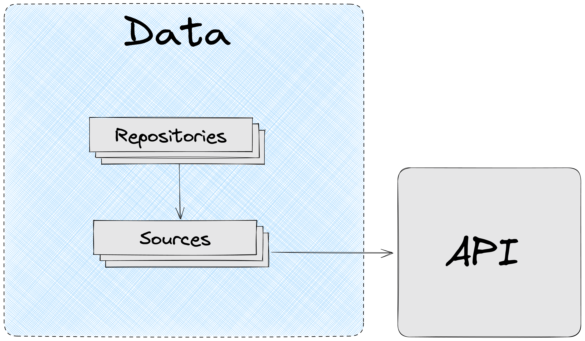

# Обзор Data

## Основная концепция



`Data` слой отвечает за работу с данными:

- Получения данных из источников (сервер, localStorage…)
- Агрегация и форматирование данных
- Кэширование и модификация кэша
- Хранение и распространение DTO по приложению

`Data` позволяет:

- Защитить приложение от изменений API
- Отвязаться от источника данных и методе их получения

`Data` содержит три сегмента:

- `Repositories` . Facade, предоставляющий данные приложению.
- `Sources`. Сервисы, отвечающие за получение данных из разных источников. Sources может быть автосгенерированным
- `Values`. Переиспользуемые между `sources` и `repositories` типы и enums

```
├── app/                          
├── screens/                  
├── modules/        
├── data/
|    ├── repositories/ 
|    ├── sources/
|    ├── values/
|    └── index.ts                  
└── shared/    
```

## Защита от изменений API

`Data` позволяют защитить приложение от изменений API.

`Sources` напрямую зависят от API и источника, они недоступны для остального приложения.

Приложение зависит только от `Repositories,` поэтому при нежелательном изменении интерфейса данных на API, изменения коснуться только `Repositories` , остальная часть приложения останется неизменной.


**Пример**

Мы получаем с сервера данные о тарифе. `tariffNetworkSources` отвечает за получение данных из конкретного источника по REST.

`TariffRepository` в свою очередь использует `tariffNetworkSources` для получения данных и их форматирования для приложения.

В какой-то момент API изменило формат данных для тарифов. Если мы не хотим вносить правки в `Modules`, которые потребляют данные, то мы можем на уровне `TariffRepository` сделать правки, по приведению нового интерфейса данных тарифов к тому, что ожидает наше приложение.

В итоге: правки были внесены только в `TariffRepository` , остальная система затронута не была.

## Независимость приложения от источника данных

Благодаря `Data` приложение не зависит от источника данных. По необходимости источник данных и метод получения данных может быть изменен.

`Repositories` используют `Sources` для получения данных.  `Sources` при этом зависит от конкретного метода получения данных (REST, GQL, WS…). Приложение в свою очередь взаимодействует только с `Repositories` и не знает откуда и как данные были получены.

**Пример**

`tariffSourcesNetwork` может получать данные по REST, при этом `requestSourcesNetwork` может получать данные по GQL.

Нам необходимо получить данные о заявке и выбранной в ней тарифе. `RequestRepository` предоставит нашему приложению метод `getRequestWithTariff` , который соберет данные из разных источников и отдаст их приложению.

Итог: приложение не знает каким способом и от куда были запрошены данные.
