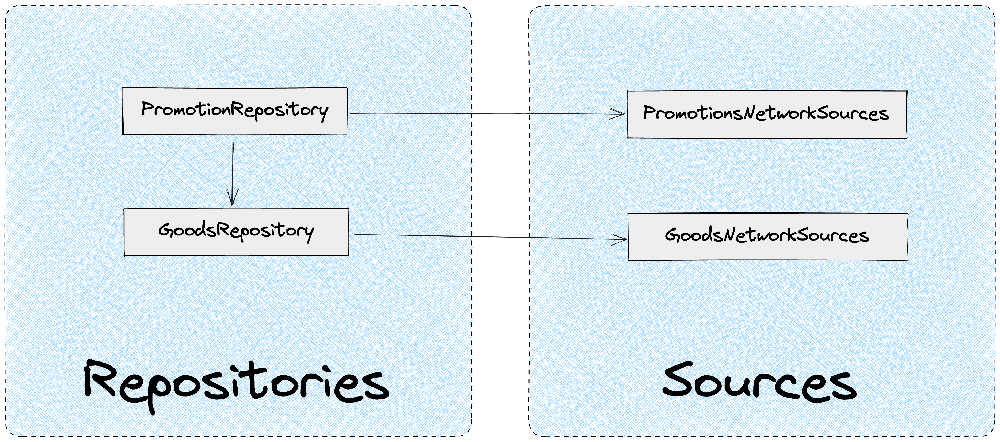

# Repositories

`Repositories` - это фасады, используемые в приложении для работы с данными.

`Repositories:`

- Используют `sources` для получения данных из разных источников
- Форматируют данные для приложения
- Агрегируют данные из разных источников
- Кэшируют данные. Позволяют работать с данными кэша (модифицировать, инвалидировать…)

`Repositories` содержит сервисы для работы с данными.

Пример структуры:

```
├── app/                          
├── screens/                  
├── modules/        
├── data/
|    ├── repositories/ 
|    |    ├── UserRepository/
|    |    |    ├── UserRepository.ts
|    |    |    ├── UserRepository.test.ts
|    |    |    ├── dto.ts
|    |    |    ├── enums.ts
|    |    |    └── index.ts
|    |    ├── enums.ts
|    |    ├── types.ts
|    |    └── index.ts      
|    ├── sources/      
|    └── index.ts                  
└── shared/    
```

[Пример `Repository:`](https://github.com/kaluga-astral/vite-boilerplate/blob/main/data/repositories/BookRepository/BookRepository.ts)

## Разбиение на Repositories

Каждый `Repository` ответственен за работу с конкретным типом данных.

**Пример**

В предметной области онлайн-магазина нам необходимо получать данные о:

- Пользователе
- Товарах
- Акциях

Для каждого типа данных должны быть созданы свои `Repositories`:

```
├── app/                          
├── screens/                  
├── modules/        
├── data/
|    ├── repositories/ 
|    |    ├── UserRepository/
|    |    ├── GoodsRepository/
|    |    ├── PromotionsRepository/
|    |    └── index.ts      
|    ├── sources/      
|    └── index.ts                  
└── shared/    
```

## Агрегация и форматирование данных

`Repositories` для получения данных используют `Sources`.

Один `Repository` может взаимодействовать с несколькими `sources`.

Также `Repository` могут взаимодействовать друг с другом для получения данных.

**Пример**

Мы работает в предметной области онлайн-магазина.

Нам в `Promotion` модуле необходимо отобразить данные об акции:

- Название, описание акции
- Список товаров, подходящих под акцию
  - Краткая информация о товаре: название, стоимость, изображение

`promotionNetworkSources` позволит получить данные об акции, но она будет содержать внутри себя только список ID товаров.

`GoodsRepository` предоставляет метод для получения и кэширования данных по товарам. Использует для получения данных `goodsNetworkSources.`

`PromotionRepository` предоставит метод, который получит данные из `promotionNetworkSources` и `GoodsRepository` , затем склеит их и отформатирует так, как удобно нашему приложению.



## Работа с кэшом

На уровне `Repositories` должна происходить работа с кэшом.

`Repositories` должен скрывать реализацию кэша и предоставлять приложению абстрактные методы по работе с данными.

Пример `UserRepository` с использованием [@astral/mobx-query](https://www.npmjs.com/package/@astral/mobx-query) для кэширования:

```tsx
import { CacheService } from '@astral/shared';

import { UserNetworkSources } from '../../sources';

class UserRepository {
  private userInfoCacheID = 'user-info';

  constructor(
    private readonly userNetworkSources: UserNetworkSources,
    private readonly cacheService: CacheService,
  ) {
    this.userNetworkSources = userNetworkSources;
    this.cacheService = cacheService;
  }

  public getUserInfo = () =>
    cacheService.createQuery(
      [this.userInfoCacheID],
      this.userNetworkSources.getPersonInfo,
    );

  public invalidateUserInfo = () => {
    this.cacheService.invalidate([this.userInfoCacheID]);
  };
}
```

## DTO

`Repositories` содержат DTO, используемые в приложении.

```
├── app/                          
├── screens/                  
├── modules/        
├── data/
|    ├── repositories/ 
|    |    ├── UserRepository/
|    |    |    ├── UserRepository.ts
|    |    |    ├── UserRepository.test.ts
|    |    |    ├── dto.ts
|    |    |    ├── enums.ts
|    |    |    └── index.ts
|    |    └── index.ts      
|    ├── sources/     
|    └── index.ts                  
└── shared/    
```

`Repository` использует для формирования своих DTO, типы из `sources`.

Возможен сценарий простого реэкспорта DTO из `sources`, это допустимо и необходимо для того, чтобы в любой момент можно было изменить формат данных в `Repository`.

`data/repositories/UserRepository/dto.ts`

```tsx
import {
  UserNetworkSourcesDTO,
  TariffNetworkSourcesDTO,
} from '../../sources';

export namespace UserRepositoryDTO {
  export type User = UserNetworkSourcesDTO.User & UserNetworkSourcesDTO.Permissions;

  export type EditUserInfoInput = UserNetworkSourcesDTO.EditUserInfoInput;

  export type TariffList = TariffNetworkSourcesDTO.TariffList;
}
```

### Enums

DTO `Repositories` могут содержать `enums`. `Enums` должны быть созданы или реэкспортированы через `enums.ts` в конкретном `Repository` .

`data/repositories/UserRepository/enums.ts`

```tsx
export { UserPermission } from '../sources';

export enum UserStatus {
  active,
  inactive,
}
```

## Проксирующие запросы

В `Repositories` достаточно часто могут использоваться проксирующие запросы на `sources`:

`dto.ts`

```tsx
import { TariffNetworkSourcesDTO } from '../../sources';

export namespace TariffRepositoryDTO {
  export type Tariff = TariffNetworkSourcesDTO.Tariff;

  export type TariffList = TariffNetworkSourcesDTO.TariffList;
}
```

`TariffRepository.ts`

```tsx
export class TariffRepository {
  constructor(private readonly tariffNetworkSources: TariffsNetworkSources) {
    this.tariffNetworkSources = tariffNetworkSources;
  }

  public getTariffs = async () => this.tariffNetworkSources.getTariffs();
}
```

Данное явление является нормой потому, что позволяет нашему приложению не зависеть от `sources` и API.

По необходимости, мы можем изменить источник данных или формат данных на уровне `Repository`.

## DI для Repositories

Все зависимости `Repository` должны быть инвертированы. Рекомендуется использовать простой DI без IoC.

```tsx
import { CacheService } from '@astral/shared';

import { UserNetworkSources } from '../../sources';

class UserRepository {
  private userInfoCacheID = 'user-info';

  constructor(
    private readonly userNetworkSources: UserNetworkSources,
    private readonly cacheService: CacheService,
  ) {
    this.userNetworkSources = userNetworkSources;
    this.cacheService = cacheService;
  }

  public getUserInfo = () =>
    cacheService.createQuery(
      [this.userInfoCacheID],
      this.userNetworkSources.getPersonInfo,
    );

  public invalidateUserInfo = () => {
    this.cacheService.invalidate([this.userInfoCacheID]);
  };
}
```

`Repository` должен контролировать зависимости через конструктор. В конструкторе описываются все внешние зависимости.

Плюсы использования DI:

- Контроль зависимостей. Сразу видно от чего зависит `Repository`
- Простота тестирования. Зависимость можно подменить на моковую для теста
- Низкое зацепление. `Repositories` зависят от абстрактный интерфейсов, а не от конкретных реализаций

---
