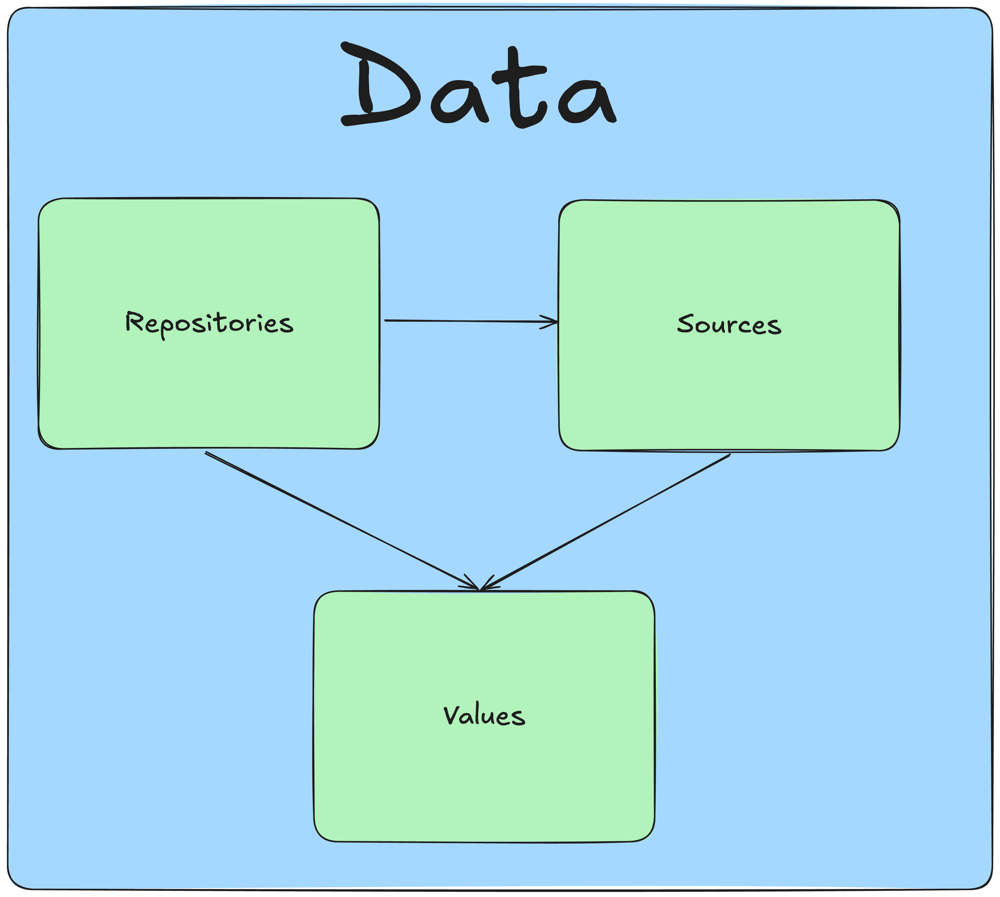

# Values. Переиспользование types и enums

`Values` - это аналог `DDD Value Object`.
`Values` - типы, потребляемые приложением.

`Values` доступны в:
- `Sources`
- `Repositories`
- `Modules`, `screens` и `app` слоях



```     
├── data/
|    ├── repositories/ 
|    ├── sources/
|    ├── values/
|    |    ├── warrant/
|    |    ├── pagination/
|    |    |    ├── pagination.ts
|    |    |    ├── enums.ts
|    |    |    └── index.ts    
|    |    └── index.ts    
|    └── index.ts                  
```

## Назначение

Переиспользование типов и enums между `sources` и `repositories`.

## Принцип выделения values

Тип или enums выделяется в values, если:
- Тип или enums необходимо переиспользовать между `sources` или между `repositories`
- Тип или enums однозначно не является частью сущности, с которой работает конкретный `source` или `repository`

## Пример

В data слое присутствуют sources: `abonentsNetworkSources` и `docflowNetworkSources`:
```     
├── data/
|    ├── repositories/ 
|    ├── sources/
|    |    ├── abonentsNetworkSources/
|    |    ├── docflowNetworkSources/
|    |    └── index.ts    
|    ├── values/
|    └── index.ts                  
```

В обоих sources используется набор полей под названием `warrant`:

```abonentsNetworkSources/dto.ts```
```ts
import { WarrantType } from './enums';

export namespace AbonentsNetworkSourcesDTO {
  type Warrant = {
    type: WarrantType,
    ...
  };

  export type Abonent = {
    id: string;
    ...
    warrant: Warrant;
  }
}
```

```abonentsNetworkSources/enums.ts```
```ts
export enum WarrantType {
  Default,
  External
};
```


```docflowNetworkSources/dto.ts```
```ts
import { WarrantType } from './enums';

export namespace DocflowNetworkSourcesDTO {
  type Warrant = {
    type: WarrantType,
    ...
  };

  export type Docflow = {
    id: string;
    ...
    warrant: Warrant;
  }
}
```

```docflowNetworkSources/enums.ts```
```ts
export enum WarrantType {
  Default,
  External
};
```

Warrant и WarrantType можно вынести в `values` так как, данный набор полей и enums не является непосредственной частью ни `abonent`, ни `docflow`:
```     
├── data/
|    ├── repositories/ 
|    ├── sources/
|    |    ├── abonentsNetworkSources/
|    |    ├── docflowNetworkSources/
|    |    └── index.ts    
|    ├── values/
|    |    ├── warrant/
|    |    |    ├── warrant.ts
|    |    |    ├── enums.ts
|    |    |    └── index.ts    
|    |    └── index.ts    
|    └── index.ts                  
```

```values/warrant/warrant.ts```
```ts
import { WarrantType } from './enums';

export namespace WarrantDTO {
  export type Warrant = {
    type: WarrantType,
    ...
  };
}
```

```values/warrant/enums.ts```
```ts
export enum WarrantType {
  Default,
  External
};
```

```abonentsNetworkSources/dto.ts```
```ts
import { WarrantDTO } from '../../values';

export namespace AbonentsNetworkSourcesDTO {
  export type Abonent = {
    id: string;
    ...
    warrant: WarrantDTO.Warrant;
  }
}
```

## Pagination и sorting

Общие типы и enums для пагинации и сортировки выносятся в `values`:

```     
├── data/
|    ├── repositories/ 
|    ├── sources/
|    ├── values/
|    |    ├── pagination/
|    |    |    ├── pagination.ts
|    |    |    ├── enums.ts
|    |    |    └── index.ts    
|    |    ├── sort/
|    |    |    ├── sort.ts
|    |    |    ├── enums.ts
|    |    |    └── index.ts    
|    |    └── index.ts    
|    └── index.ts                  
```

```values/pagination/pagination.ts```
```ts
import { WarrantType } from './enums';

export namespace PaginationDTO {
  export type Meta = {
    total: number;
  };

  export type Input = {
    offset: number;
    count: number;
  };
}
```

```values/sort/enums.ts```
```ts
export enum SortOrder {
  Ascending,
  Descending,
}
```

## Несоответствие ответов `sources` и `values`

`Values` - это клиентский формат данных, который необходим приложению.
Типы в `values` могут не соответствовать типам в `sources` из-за того, что на уровне `repository` происходит форматирование данных.
В таком случае типы `sources` не должны использовать типы из `values` - sources должны внутри себя описывать уникальные типы.
При этом `repositories` должны отдавать приложению интерфейс, соответствующий `values`.

### Formatters. Форматирование значений из sources в repositories

Если типы `values` отличаются от `sources`, и при этом необходимо в нескольких `repositories` одинаково форматировать данные для `values`, то создаются `formatters`:

```     
├── data/
|    ├── repositories/ 
|    ├── sources/
|    ├── values/
|    |    ├── address/
|    |    |    ├── address.ts
|    |    |    ├── formatters/
|    |    |    |    ├── formatFullAddress/
|    |    |    |    |    ├── formatFullAddress.ts
|    |    |    |    |    ├── formatFullAddress.test.ts
|    |    |    |    |    └── index.ts
|    |    |    └── index.ts     
|    |    └── index.ts    
|    └── index.ts                  
```

### Пример

`abonentsNetworkSources` для `Abonent` возвращает поле адрес в виде строки, но в приложении необходимо распарсить строку и получить конкретные значения.
Для любого адреса в любых DTO мы хотим получать не строку, а объект.

```abonentsNetworkSources/dto.ts```
```ts
import { WarrantDTO } from '../../values';

export namespace AbonentsNetworkSourcesDTO {
  export type Abonent = {
    id: string;
    address: string;
  }
}
```

```values/address/address.ts```
```ts
export namespace AddressDTO {
  type FullAddress = {
    city: string;
    street: string;
  }
}
```

```values/address/formatters.ts```
```ts
export const formatFullAddress = (address: string): AddressDTO.FullAddress  => {...};
```

```repositories/abonentRepository/abonentRepository.ts```
```ts
import { formatFullAddress } from '../../values';

export class AbonentRepository {
  ...
  public getAbonent = (id: string) => {
    const { address, ...abonent } = this.abonentsNetworkSources.getAbonent(id);
  
    return {
      ...abonent,
      address: formatFullAddress(address),
    };
  }
  ...
}
```

## Style Guide

### DTO для values описываются в namespace

