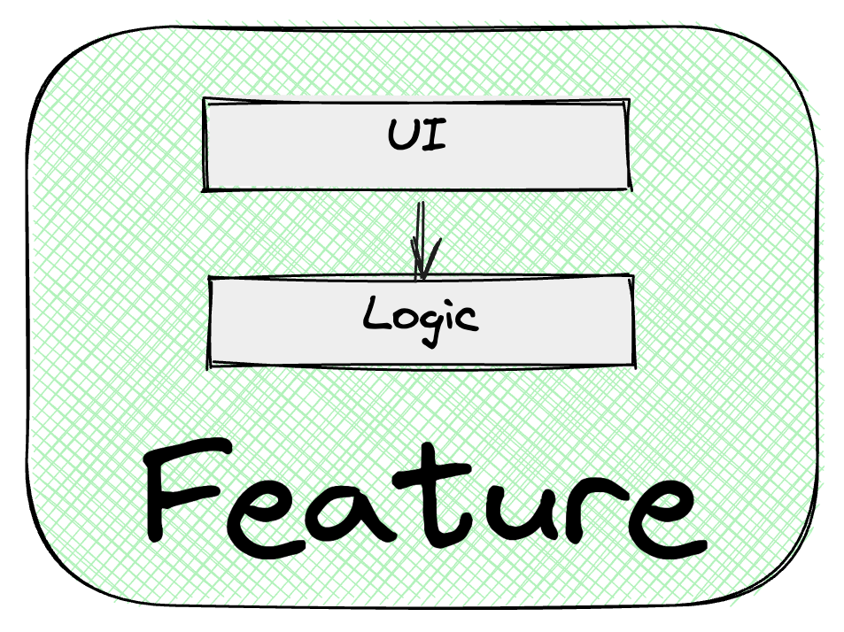

# Отделение логики от view

UI компонент должен быть ответственным **только за отображение,** количество ui логики в компоненте должно быть сведено к нулю.

Вся логика реализуется вне компонента в [`UIStore`](../UIStore/overview) или [`useLogic`](../useLogic/overview).



## Мотивация

Отделение view слоя от логики дает следующие преимущества:

- Возможность изменять логику и ui независимо
- Простота переиспользования логики или ui по необходимости
- Независимость от используемого фреймворка. Фреймворк при определенных обстоятельствах можно заменить, а логику переиспользовать
- Простота тестирования. Можно тестировать отдельно логику и ui
- Однозначность расположения логики. Вся логика всегда находится в одном месте
- Логика не “размазывается” по компонентам. Избавляет от сложностей в поддержке кода
- Повышение читаемости кода
- Упрощение поддержки и доработки приложения

## UI компонент

Компонент должен содержать только то, что непосредственно связано с фреймворком, ответственным за отображение.

В ui компоненте **не должно** находится:

- Логики форматирования данных для отображения
- Логики работы с данными
- Флагов, отвечающих за отображение частей ui

В ui компоненте **должно находится**:

- Работа с браузерным API
- Работа со спецификой фреймворка
  - Обработка пользовательского ввода с целью передачи данных в логику
  - Работа с DOM
- Потребление данных из логики для их отображения
- Коннект методов логики с обработкой пользовательского ввода и браузерных событий

**UI компонент потребляет логику фичи и полностью зависит от ее интерфейсов.**

## Логика

В рамках `features` бизнес-логика и ui логика не разделяется.

Логика в `feature` содержит:

- Формирование данных для отображения в ui
- Работу с данными, взаимодействие с `Data` слоем
- Работу с флагами, которые в компоненте будут ответственны за отображение компонента (например, удаление из DOM, изменение цвета и т.п.)

**Логика фичи не должна зависеть от ui компонента**. **Зависимости направлены от ui к логике:**


Логика может быть реализована на любом предпочтительном стэке с использованием:

- state manager
- hook (React стэк)
- service
- utils

### Мотивация объединения бизнес и ui логики в фиче

- Если оставлять ui логику в компоненте, то велика вероятность просачивания бизнес логики в компонент
- В реальном проекте зачастую достаточно сложно решить что относится к бизнес логике, а что относится к ui. Возникают ситуации, когда разработчики замедляются в реализации фичи из-за дилеммы: куда поместить эту логику? В компонент или в store?

### State manager для реализации логики

Для реализации логики рекомендуется использовать state manager.

State manager позволит:

- Не завязываться на специфику ui фреймворка
- Избежать нежелательных зависимостей от ui. Технически невозможно в state manager поместить специфику ui фреймворка
- Писать простые тесты для логики
- Простота распространения данных в приложении

### Использование react hooks для реализации логики

Желательно избегать использования react hooks для реализации логики. Так как hooks - это часть react, то в них доступны все методы по работе с ui, это значит в логику проникнет специфика фреймворка.

Из этого могут возникнуть проблемы:

- Невозможность переиспользования логики в другом стэке
- Смешивание ui и логики. Без контроля в hooks будет попадать логика работы с ref, react событиями и т.п.
- Невозможность переиспользования логики из-за косвенной зависимости от ui
- Сложность работы с глобальными данными
- Сложность тестирования. Для тестирования hooks необходимы дополнительные инструменты (react-testing-library, jsdom | happydom)

### Переиспользование логики между фичами

Логику необходимо выносить в `Domain` , если логику, реализованную внутри фичи, потребовалось:

- Переиспользовать в другой фиче
- Переиспользовать в другом модуле
- Использовать для интеграции с другой фичей

[Подробный обзор Domain](../domain)

### Использование DI для контроля зависимостей

Логика должна использовать базовую концепцию DI (dep. injection) для того, чтобы контролировать свои зависимости.

Плюсы подхода:

- Логику проще поддерживать за счет того, что нет скрытых зависимостей. Все зависимости сразу видны и очевидны
- Логику проще тестировать. Зависимости можно просто подменять на тестовые сущности

**Пример**

```tsx
import { makeAutoObservable } from 'mobx';
import { CartStore } from '@astral/modules/cart';

export class CatalogStore {
  constructor(private readonly cartStore: CartStore) {
    makeAutoObservable(this, {}, { autoBind: true });
  }

  addToCart = (productID: string) => {
    this.cartStore.add(productID);
  };
}
```

## Демонстрация профита отделения ui и логики

Представим, что у нас есть блок, в котором происходит оплата услуги по карте.

Данный блок является фичей `CardPayment` в модуле `Payment`.

Сейчас фича производит оплату через конкретную платежную систему после успешной оплаты отправляем нашему API данные.

Через некоторое время появилась необходимость реализовать новую фичу, ui которой должен повторять `CardPayment`, но при этом должна использоваться другая платежная система и после оплаты данные отправляются на другое API.

Так как мы сразу отделили логику и ui компонент, то мы можем без особых проблем вынести исходную логику `CardPayment` в `Domain` и использовать для `CardPayment` один и тот же ui, но разную логику.

