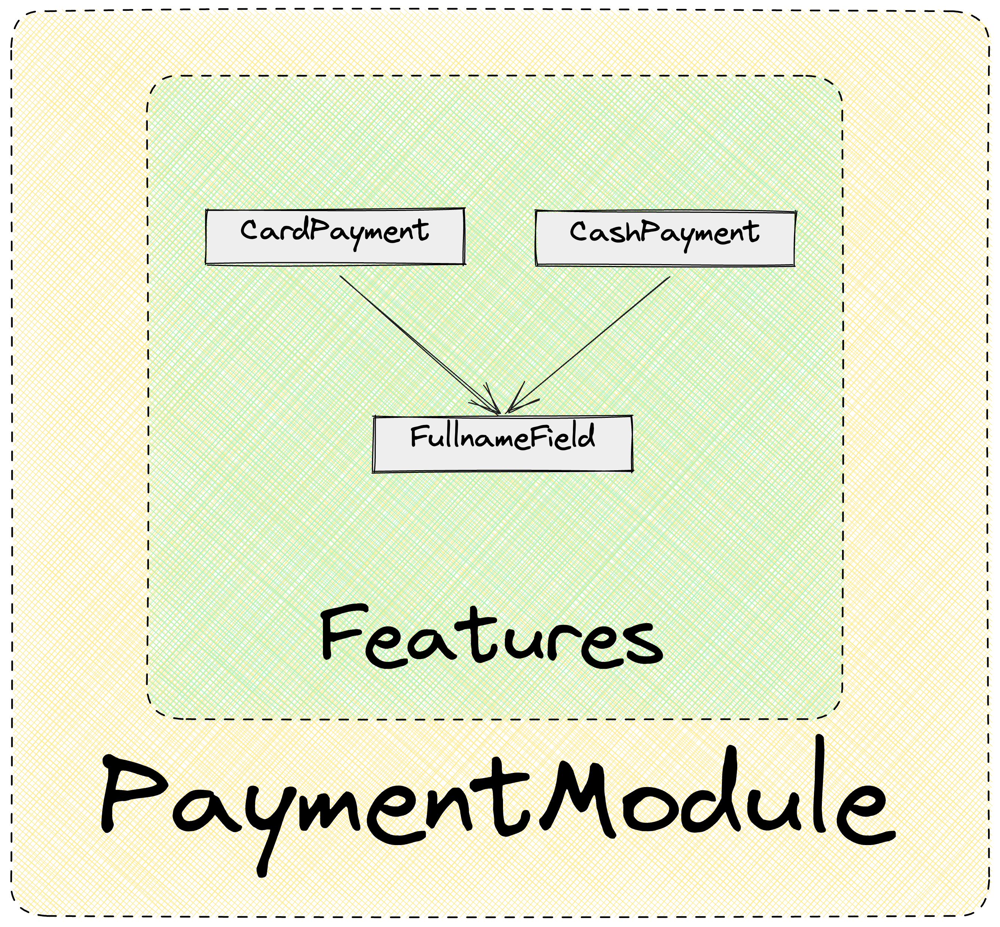

# Зависимости фичей

Если одной фиче необходимо использовать другую, то их интеграцию стоит делать не на уровне `features`, а на уровне `screens`.

Это помогает уменьшить зацепление фичей и повысить их переиспользуемость.

## Переиспользуемые фичи

Есть ситуации, когда между фичами необходимо переиспользовать компонент, но интеграция подобных фичей на уровне `screen` является неоправданно сложной.

В таких случаях допускается выделение компонента в третью фичу и использования ее внутри других фичей.

**Пример**

В `CardPayment` и `CashPayment` фичах есть идентичные поля для ввода ФИО. Компонент для  для ввода ФИО выносится в третью фичу `FullnameField` .

## Интеграция фич

Для интеграции фич используется слой screens.

[Подробный обзор Screens](../../screens)

---
