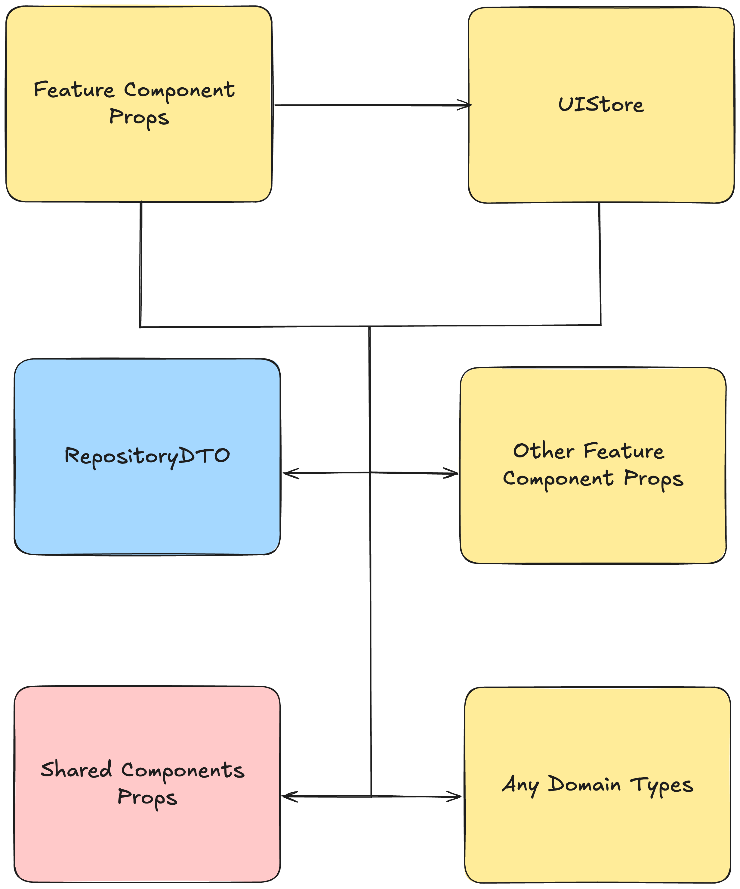

# Формирование props компонента фичи

Props фичи может формироваться из:
- Типов `UIStore`
- Типов DTO из `data`
- Props других фичей
- Props shared компонентов

```ts
type Props = {
  data: UIStore['data'];
  list: RequestsRepositoryDTO.List;
  onClick: ButtonProps['onClick'];
};
```



**`UIStore` при этом не зависит от props компонента своей фичи**.
