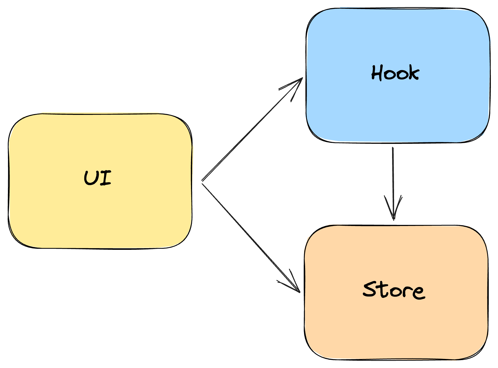

# useLogic

`useLogic` предназначен для реализации логики фичи, сильно зацепленной на используемую react-библиотеку и фичи самого react.
Если логику можно реализовать без использования хука, то стоит отдать предпочтение [UIStore](./UIStore).

```
├── PaymentForm/
|    ├── UIStore/ 
|    ├── useLogic/ 
|    |    |── utils/
|    |    |── hooks/
|    |    |── useLogic.ts
|    |    |── useLogic.test.ts
|    |    |── constants.ts
|    |    |── enums.ts
|    |    |── types.ts
|    |    └── index.ts
|    ├── PaymentForm.tsx
|    └── index.ts 
```

## useLogic - единственная точка входа данных для компонента

Если в фиче есть `useLogic`, то только из него должны потребляться данные для компонента.
Даже если в фиче используется UIStore или другие stores:

```tsx
const Card = (props: Props) => {
  const [uiStore] = useState(() => createUIStore(props));

  const { fullName, isShowDescription, description } = useLogic(uiStore);

  return (
    <Wrapper>
      <Typography>{fullName}</Typography>
      {isShowDescription && <Typography>{description}</Typography>}
    </Wrapper>
  );
};
```

```ts
export const useLogic = (store: UIStore) => {
  const isShowDescription = useEndScroll();

  return {
    isShowDescription,
    fullName: store.fullName,
    description: store.fullName,
  };
};
```

Hook должен возвращать абстрактный интерфейс, с которым работает компонент.

Благодаря этой абстракции появляется возможность изменить инструмент реализации логики, при этом оставить выходной интерфейс и ui неизменными.

## Взаимодействие с UIStore

`useLogic` должен принимать `UIStore` и другие stores параметром по ссылки для возможности более простого тестирования:
```ts
export const useLogic = (store: UIStore) => {
  const isShowDescription = useEndScroll();

  return {
    isShowDescription,
    fullName: store.fullName,
    description: store.fullName,
  };
};
```

### Инициализация UIStore

`UIStore` при использовании `useLogic` инициализируется в компоненте и передается в `useLogic`:
```tsx
const Card = (props: Props) => {
  const [uiStore] = useState(createUIStore);

  const { fullName, isShowDescription, description } = useLogic(uiStore);

  return (
    <Wrapper>
      <Typography>{fullName}</Typography>
      {isShowDescription && <Typography>{description}</Typography>}
    </Wrapper>
  );
};
```

### Зависимости

`UIStore` не должен зависеть от `useLogic`:



Типы должны импортироваться из `UIStore` и `useLogic`.
А в свою очередь компонент для формирования своих props может использовать типы как из `useLogic`, так и из `UIStore`.

## Разделение зон ответственности между UIStore и useLogic

### Зона ответственности store

- Работа с данными. Взаимодействие с слоем `data`
- Форматирование данных для отображения, если эти данные не завязаны на изменение state формы

## Зона ответственности hooks

### Описание типов формы

`useLogic` должен содержать типы формы:

```tsx
export type BookFormValues = {
  name: string;
  genre: BookRepositoryDTO.GenreDTO;
  pageCount: string;
  author: AdministrationRepositoryDTO.CreateBookInputDTO['author'];
  coAuthor?: AdministrationRepositoryDTO.CreateBookInputDTO['coAuthor'];
  isPresentCoAuthor: boolean;
};
```

### Валидация формы

`useForm` должен взаимодействовать с валидацией формы:

```tsx
const validationSchema = v.object<BookFormValues>({
  name: v.string(),
  genre: v.object<BookFormValues['genre']>({
    id: v.string(),
    name: v.string(),
    description: v.optional(v.string()),
  }),
  pageCount: v.number(),
  author: v.object<BookFormValues['author']>({
    name: v.string(),
    surname: v.string(),
  }),
  isPresentCoAuthor: v.optional(v.boolean()),
  coAuthor: v.when({
    is: (_, ctx) => Boolean(ctx.values?.isPresentCoAuthor),
    then: v.object<BookFormValues['author']>({
      name: v.string(),
      surname: v.string(),
    }),
    otherwise: v.any(),
  }),
});

export const useLogic = () => {
  const form = useForm<BookFormValues>({ validationSchema });

	...

};
```

### Инициализация формы с необходимыми параметрами

```tsx
export const useLogic = (): Result => {
  const form = useForm<BookFormValues>({ validationSchema });

	...

};
```

### Подписка на изменение полей и state формы

```tsx
export const useLogic = (
  store: UIStore,
  { onSubmit }: Params,
): Result => {
  const form = useForm<BookFormValues>({ validationSchema });

  const isPresentCoAuthor = form.watch('isPresentCoAuthor');

  const name = form.watch('name');

  useEffect(() => {
    store.findBook(name);
  }, [name]);

  return { form, isPresentCoAuthor, submit: form.handleSubmit(onSubmit) };
};
```

### Формирование данных для отображения

Если данные для отображения завязаны на изменение state формы, то логика форматирования помещается в хук:

```tsx
export const useLogic = (): Returned => {
  const { watch } = useBookFormContext();

  const { name, author } = watch();

  return {
    name,
    authorFullName: `${author.name} ${author.surname}`,
  };
};
```

## При использовании useLogic в компоненте не должно оставаться никакой логики, кроме инициализации

В `useLogic` переносятся из компонента:
- Подвязка на `mount`, `unmount`
- Создание `ref`
- Обработка событий

## Style guide

[Style Guide | useLogic](https://kaluga-astral.github.io/style-guide/docs/rules/arch/modules/features/logic-hook)

## Тестирование

Тестировать store и hook необходимо отдельно.

## Пример

[Vite-boilerplate](https://github.com/kaluga-astral/vite-boilerplate/tree/main/modules/administration/features/BookForm)
