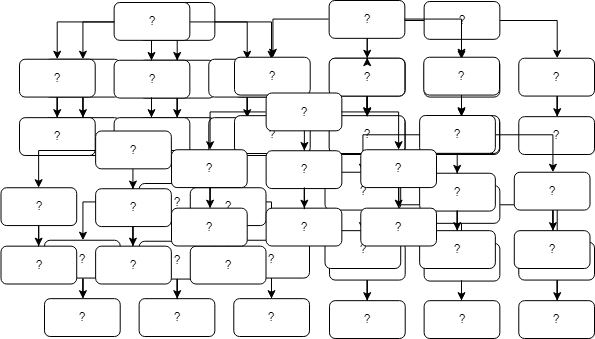
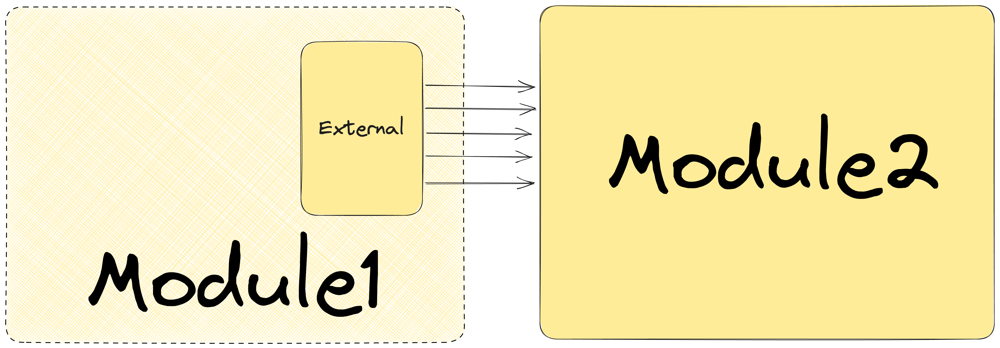

# Обзор Modules


**Modules** **- самый важный слой приложения.**

Данный слой содержит реализацию бизнес требований, которые делают продукт конкурентоспособным. Именно на этот слой должно быть обращено наибольшее внимание при проектировании и разработке.

## Мотивация

Для качественной реализации бизнес требований необходимо учитывать особенности предметной области проекта. Она состоит из набора понятий, сущностей и процессов, которые являются фундаментом разработки.

Однако, по мере роста функционала приложения, список концепций предметной области может стать слишком большим и запутанным. Концепции могут стать расплывчатыми, а модели предметной области сложными и неуправляемыми. Это приводит к тому, что приложение становится похожим на "Big ball of mud” (большой комок грязи).



Для решения описанной проблемы в Astral Architecture Guide применяются методы стратегического проектирования DDD (Domain Driven Design).

## Разбиение предметной области на модули

Большая предметная область проекта разбивается на подобласти (модули). Каждая подобласть содержит в себе свой изолированный набор концепций.

Подобласти или модули - это изолированные наборы концепций, которые связаны между собой.

Преимущества использования данного метода:

- Позволяет упростить восприятие модели предметной области, поскольку каждый модуль содержит только те концепции, которые ему необходимы. Это также способствует более четкому пониманию бизнес-требований и их реализации.
- Упрощает масштабирование приложения и улучшает его производительность. Если функционал приложения распределен по модулям, то разработчики могут работать над каждым модулем независимо друг от друга, что ускоряет процесс разработки.
- Способствует упрощению тестирования и сопровождения приложения. Если каждый модуль содержит только те концепции, которые ему необходимы, то тестирование каждого модуля становится более простым и эффективным.
- Позволяет распределить зоны ответственности команды и зоны влияния концепций.

### Единый язык

Для того чтобы каждый модуль был максимально понятен и согласован внутри команды разработчиков, важно использовать единый язык в рамках каждого модуля. Это означает, что каждый модуль должен иметь свой словарь терминов и понятий, которые используются внутри этого модуля.

При этом, одинаковые термины в разных модулях могут иметь разные значения. Например, в предметной области мониторинга ошибок (Sentry) в модуле авторизации и аутентификации `User` будет иметь одно значение и фичи, а в модуле отображение ошибок `User’ом` будет является пользователь приложения, в котором произошла ошибка.

Использование единого языка позволяет:

- Уменьшить количество недопониманий и ошибок при разработке и поддержке кода.
- Улучшить коммуникацию между разработчиками и другими участниками проекта, такими как QA, менеджеры проекта и Backend.
- Избежать двойного трактования понятий.

## Сегментирование модулей


Модуль содержит два сегмента:

- **`Features`**. Фичи, поставляемые модулем
- **`Domain`**.  Логика, поставляемая модулем

Пример структуры:

```
├── app/                          
├── screens/                  
├── modules/      
|    └── payment/ 
|    |    ├── features/   
|    |    ├── domain/   
|    |    └── index.ts  
├── data/               
└── shared/    
```

### Features

[Подробный обзор Features](./features/overview)

### Domain

[Подробный обзор Domain](./domain)

## Зависимости модулей

**Modules** зависит от:

- Shared
- Data
- Других модулей


Зависимости от Shared и Data нет необходимости контролировать, они могут свободно использоваться в **`Modules`**.

Однако модули системы могут использовать `features` и `domain` друг друга. Важно контролировать зависимости между модулями и следить за тем, чтобы уровень зацепления был наименьшим.


**Низкий уровень зацепления позволяет вносить изменения в модули без значительного влияния на остальные модул**и. Это означает, что при изменении логики в одном модуле, другие модули не будут затронуты. Это также способствует повторному использованию кода, так как каждый модуль может быть использован в других проектах или в других частях текущего проекта.

Для контроля зависимостей между модулями используются следующие концепции:

- Использование `index` файлов для предоставления публичного API. Контроль поставляемых фич
- Использование `external` файлов для контроля входящих зависимостей



```
├── app/                          
├── screens/                  
├── modules/ 
|    ├── payment/ 
|    |    ├── features/
|    |    ├── domain/
|    |    ├── external.ts # Входящие зависимости      
|    |    └── index.ts    # Публичное API модуля          
├── data/              
└── shared/
```

### Использование `index` файлов для предоставления публичного API

Каждый модуль должен предоставлять публичное API: какие фичи модуль готов предоставлять приложению.

Для реализации данного подхода используются `index` файлы:

```
├── app/                          
├── screens/                  
├── modules/ 
|    ├── payment/ 
|    |    ├── features/
|    |    ├── domain/
|    |    └── index.ts # Публичное API модуля          
├── data/              
└── shared/
```

`index.ts`
```tsx
export { CardPayment, CashPayment } from './features';

export {
  CardPaymentStore,
  CashPaymentStore,
  type PaymentType,
} from './domain';
```

В данном примере модуль PaymentModule предоставляет для использования только то, что экспортируется из `index.ts`. Другие `features` и `domain` не доступны во вне модуля.

**Импорты из модуля должны идти только через `index`**

Valid:

```
import { CashPayment } from '@astral/modules/payment'; 
```

Invalid:

```
import { PayButton } from '@astral/modules/payment/features'; 
```

### Использование `external` файлов для контроля входящих зависимостей.

Необходимо контролировать уровень зацепления между модулями.

Может произойти ситуация, когда один модуль сильно зацеплен с другим. Без промежуточного слоя это приведет к хрупкости одного из модулей - изменение одного модуля провоцирует изменения в другом.


Для решения данной проблемы каждый модуль должен явным образом описывать свои входные зависимости от других модулей через `external` файлы.


Благодаря `external` мы можем без усилий проследить за зависимостями модуля и при необходимости избавится от нежелательного зацепеления.

**Пример**

`Payment` модуль использует из `Auth` `UserStore`.

```
├── app/                          
├── screens/                  
├── modules/ 
|    ├── auth/ 
|    ├── payment/ 
|    |    ├── features/
|    |    ├── domain/
|    |    ├── external.ts 
|    |    └── index.ts          
├── data/              
└── shared/
```

`Payment` должен делать импорт из `Auth` модуля только через `external` файл.

Valid

`external.ts`

```
export { UserStore } from '@astral/modules/auth';
```

`Payment/features/CardPayment/store/store.ts`

```
import { UserStore } from '../../../external';
...
```

Invalid

`Payment/features/CardPayment/store/store.ts`

```
import { UserStore } from '@astral/modules/auth';
...
```

## Универсальные модули (Layout)

При проектировании модулей важно понимать, что существуют универсальные подобласти, которые напрямую не связаны с предметной областью проекта, но при этом содержат фичи из других модулей.

Примером такой области может являться `Layout`.

`Layout` приложения может содержать `header`, `footer`, `PageLayout` и т.п.

На первый взгляд данные фичи не относятся к предметной области проекта и должны быть помещены в `shared`. Но это не так. `Layout` может внутри себя содержать фичи из `AuthModule` для отображения на каждом screen пользовательских данных. Таким образом `LayoutModule` превращается в универсальный модуль потому, что косвенно связан с предметной областью проекта.

```
├── app/                          
├── screens/                  
├── modules/ 
|    ├── layout/ 
|    |    ├── features/
|    |    |    ├── AppHeader/
|    |    |    ├── AppFooter/
|    |    |    ├── AppLayout/
|    |    |    ├── PageLayout/
|    |    |    ├── FormLayout/
|    |    |    └── index.ts        
|    |    ├── domain/
|    |    └── index.ts        
├── data/              
└── shared/
```

При проектировании универсальных модулей важно определить их границы и не загружать их функциональностью, которая не относится к их основной цели.

Например, `NoAccess` фича не относится к `Layout`, подобная фича должна быть вынесена в `AccessModule`.

## С чего начать

В начале проектирования достаточно будет выделить два-три модуля, один из которых будет Layout.

По мере роста фичей в модуле вы сможете понять, что необходимо выделять отдельный модуль для набора фичей.

## Пример проектирования модулей онлайн-магазина

Допустим, мы разрабатываем приложение для онлайн-магазина.

#### Модули

Предметную область можно разбить на следующие модули:

- **Каталог товаров** - содержит все, что связано с взаимодействием **товара** и **покупателя**. Фичами модуля могут быть поиск товаров по различным параметрам, фильтрация товаров по категориям и тегам.
- **Корзина** - отвечает за управление **корзиной** **покупателя**. Фичами модуля могут быть добавление товаров в корзину, изменение количества товаров и оформление заказа.
- **Оплата** - отвечает за обработку **оплаты** **заказов** в приложении. Фичами модуля могут быть выбор способа оплаты, ввод данных платежных карт, обработка платежей и отображение статуса оплаты для пользователя.
- **Авторизация и регистрация** - отвечает за управление пользователями. Фичами модуля могут быть регистрация новых пользователей, авторизация и управление профилем пользователя.
- **Layout** - отвечает за разметку блоков приложения.

```
├── app/
├── screens/
├── modules/
|    ├── catalog/
|    ├── cart/
|    ├── payment/
|    ├── auth/
|    └── layout/
├── data/
└── shared/

```

#### Catalog Module

**Features**

```
├── app/
├── screens/
├── modules/
|    ├── catalog/
|    |    ├── features/
|    |    |    ├── CatalogList/   # Список товаров
|    |    |    ├── ProductPhoto/  # Фото товара. Является приватной фичей.
|    |    |    ├── CatalogCard/   # Карточка товара
|    |    |    ├── Filters/       # Фильтрация товаров 
|    |    |    ├── SearchBar/     # Поиск товаров
|    |    |    └── index.ts
|    |    ├── domain/
|    |    └── index.ts
|    ├── cart/
|    ├── payment/
|    ├── auth/
|    ├── layout/
├── data/
└── shared/

```

**Зависимости фичей**

`CatalogCard` должен содержать кнопку добавления товара в корзину. Добавление товара в корзину - это зона ответственности модуля `Cart`, именно там и находится ui кнопки добавления товара `AddToCartButton` и бизнес-логика добавления товара `AddToCartStore.`

`AddToCartButton` и `AddToCartStore` используются в `CatalogCard.`


**Переиспользуемая фича ProductPhoto**

`ProductPhoto` переиспользуется в `CatalogList` и `CatalogCard`.

При этом `ProductPhoto` не экспортируется из модуля `Catalog`, а значит недоступна в других модулях.

#### Cart Module

```
├── app/
├── screens/
├── modules/
|    ├── catalog/
|    ├── cart/
|    |    ├── features/
|    |    |    ├── ShoppingList/     # Список товаров, добавленных в корзину         
|    |    |    ├── OrderForm/        # Форма оформления заказа           
|    |    |    ├── AddToCartButton/  # Кнопка добавления товара в корзину
|    |    |    ├── CartIconBtn/      # Иконка корзины с счетчиком
|    |    |    └── index.ts
|    |    ├── domain/
|    |    |    ├── stores/
|    |    |    |    ├── AddToCartStore/  # логика добавления товара
|    |    |    |    └── index.ts
|    |    |    └── index.ts
|    |    └── index.ts
|    ├── payment/
|    ├── auth/
|    ├── layout/
├── data/
└── shared/
```

#### Payment Module

В модуле `payment` у нас есть необходимость в переиспользовании логики оплаты картой и оплаты наличными, поэтому эта логика выносится в `domain`.

`CardPaymentStore` и `CashPaymentStore` используется внутри фич `CardPayment`, `CashPayment`, а также может быть использована в другом модуле, например, `Cart`.

```
├── app/
├── screens/
├── modules/
|    ├── catalog/
|    ├── cart/
|    ├── payment/
|    |    ├── features/
|    |    |    ├── PaymentSwitch/    # Выбор способа оплаты         
|    |    |    ├── CardPayment/      # Оплата картой           
|    |    |    ├── CashPayment/      # Оплата наличными
|    |    |    └── index.ts
|    |    ├── domain/
|    |    |    ├── stores/
|    |    |    |    ├── CardPaymentStore/  # Логика оплаты картой
|    |    |    |    ├── CashPaymentStore/  # Логика оплаты наличными
|    |    |    |    └── index.ts
|    |    |    └── index.ts
|    |    └── index.ts
|    ├── auth/
|    ├── layout/
├── data/
└── shared/
```

#### Layout Module

Layout нашего для каждой страницы состоит из: `header`, `footer`, `sidebar`.

В `header` для отображения иконки с корзиной и счетчика товаров используется `CartIconBtn` из `Cart` модуля. При этом для каждого `screen` в `header` будет свой `title`.

Нам необходимо в `screens` переиспользовать `AppLayout`, который будет содержать `CartIconBtn` и предоставлять возможность на каждой странице добавлять свой `title` в `AppLayout`.

Это означает, что наш `Layout` связан с предметной областью проекта и поэтому для `Layout’ов` выделяется отдельный модуль.

```
├── app/
├── screens/
├── modules/
|    ├── catalog/
|    ├── cart/
|    ├── payment/
|    ├── auth/
|    ├── layout/
|    |    ├── features/
|    |    |    ├── AppLayout/      # Layout приложения         
|    |    |    ├── PageLayout/     # Layout каждой страницы
|    |    |    ├── FormLayout/     # Layout форм
|    |    |    └── index.ts
|    |    └── index.ts
├── data/
└── shared/
```

### Результат

[https://github.com/kaluga-astral/vite-boilerplate](https://github.com/kaluga-astral/vite-boilerplate)

---

## Style Guide

[Modules | Astral.Frontend Style Guide](https://kaluga-astral.github.io/style-guide/docs/category/modules)

