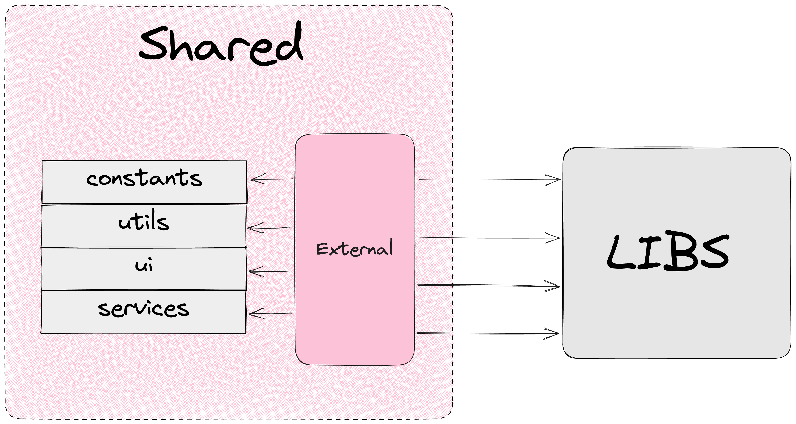

# Подробный обзор Shared

## Основная концепция



`Shared` слой содержит переиспользуемые программные сущности, не относящиеся к предметной области проекта.

**Назначение Shared**: защита приложения от низкоуровневых реализаций, включая библиотеки.

Shared можно рассматривать как слой, который можно вынести в npm пакет и использовать на других проектах с другой предметной областью.

В `Shared` могут находится:

- constants общие для всего приложения, но не относящиеся к предметной области
- types
- utils
- services
- stores
- components
- hooks
- …

Если программная сущность каким-либо образом связана с предметной областью проекта, то она должна быть помещена в `Modules`.

Пример структуры `Shared` для React стэка:

```
├── app/                          
├── screens/                  
├── modules/        
├── data/              
└── shared/
|    ├── constants/ 
|    ├── types/ 
|    ├── utils/  
|    ├── services/  
|    ├── stores/  
|    ├── ui/
|    |    ├── components/ 
|    |    ├── hooks/   
|    |    ├── external.ts    
|    |    └── index.ts      
|    └── index.ts     
```

# Доступность Shared

Shared слой доступен для использования во всех слоя приложения.


# Независимость от библиотек

`Shared` позволяет не зависеть от библиотек в других слоях, применяя к ним DI (dep. inversion).

Никакой другой слой не должен напрямую импортировать библиотеку. Есть исключения, для которых инвертирование зависимостей сделать сложно (например, react).

В `Shared` все внешние зависимости должны контролироваться через `external.ts` файлы.  `external.ts` реэкспортируют внешние зависимости.

```jsx
├── app/                          
├── screens/                  
├── modules/        
├── data/              
└── shared/
|    ├── constants/ 
|    ├── types/ 
|    ├── utils/  
|    |    ├── formatDate/  
|    |    ├── external.ts    
|    |    └── index.ts    
|    ├── services/  
|    ├── stores/  
|    ├── ui/ 
|    └── index.ts     
```

Благодаря реэкпорту зависимостей в `shared` мы можем без особых проблем заменить одну библиотеку или реализацию на другую, при этом не внося изменения в другие слои приложения.

**Пример 1**

На проекте используется `date-fns` для работы с датами, появилась потребность в переходе на `dayjs`.

Благодаря тому, что приложение не взаимодействует напрямую с `date-fns` в shared можно изменить реализацию методов для работы с датами на `dayjs`, оставив исходный интерфейс методов.

**Пример 2**

На проекте используется `mui` в качестве ui библиотеки.

Потребовалась кастомизация компонента `Button`.

Для кастомизации нам потребуется внести изменения в `shared`, при этом в другие слои приложения правки вносить не надо.

---

# Тестирование

Тесты в `shared` подчиняются единым требованиям:

[Astral.Frontend Unit Testing Guide](https://www.notion.so/Astral-Frontend-Unit-Testing-Guide-71120289ed89424e912ebe7fa8b7e39b?pvs=21)

`Shared` - это инфраструктурный слой, доступный во всех слоях приложения.

Поэтому в `shared` тестами должны быть покрыты все программные сущности, содержащие логику.

## Тестирование ui

Если ui компоненты shared содержат логику, то ui должен быть протестирован с помощью соответствующего инструмента (например, @testing-library/react).

Данная концепция отличается от [тестирования `features`](https://www.notion.so/Features-c0a1ed2b20b54fe386ebf4fc4677b235?pvs=21) потому, что `shared` не содержит бизнес-логики.

## Взаимодействие с библиотеками

**Поведение внешних библиотек тестироваться не должно**. Причина: внешняя библиотека уже должны быть протестирована, мы должны ей доверять, если используем.

**Мокать внешние библиотеки не нужно.** Исключение: библиотека взаимодействует с внешними источниками данных.

## Формирование тест-кейсов

[Unit-тесты | Astral.Frontend Style Guide](https://kaluga-astral.github.io/style-guide/docs/category/unit-тесты)

---

# Next

[Подробный обзор Data](https://www.notion.so/Data-6c243655dbfa46cfa9cac5acef41e75e?pvs=21)
